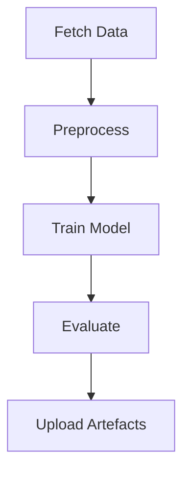
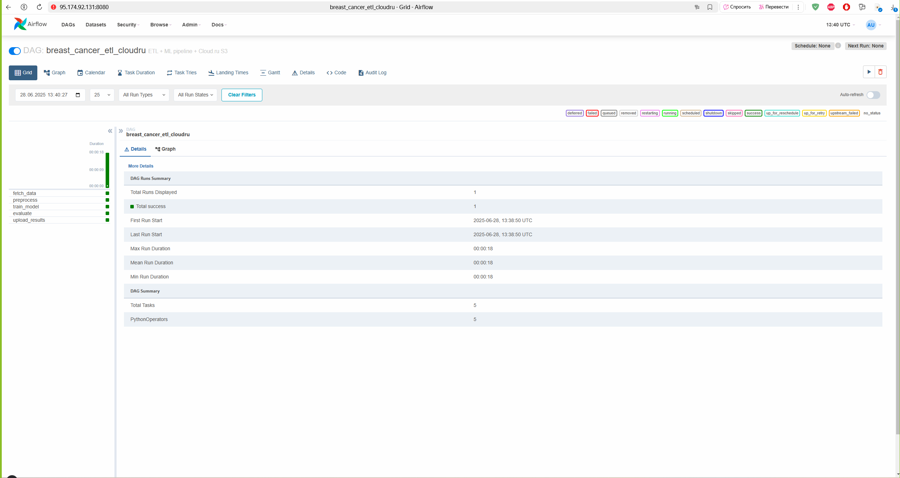
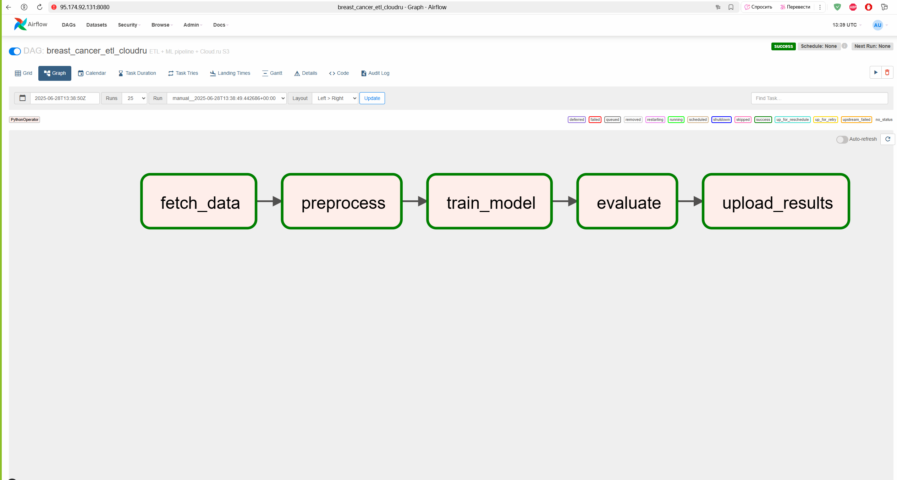

# Breast-Cancer Wisconsin ETL & ML Pipeline (Cloud.ru Object Storage)

> **Цель:** построить воспроизводимый ETL-процесс, который загружает медицинский датасет, обучает модель **LogisticRegression** и выгружает артефакты в бесплатное Object Storage Cloud.ru.

---

## Содержание

1. [ML-задача](#ml-задача)  
2. [Архитектура пайплайна](#архитектура-пайплайна)  
3. [Шаги ETL](#шаги-etl)  
4. [Оркестрация (Airflow)](#оркестрация-airflow)  
5. [Интеграция с хранилищем](#интеграция-с-хранилищем)  
6. [Запуск](#запуск)  
7. [Анализ ошибок и устойчивости](#robustness--анализ-сбоев)
8. [Идеи для развития](#идеи-развития)
9. [Скриншоты работающего дага](#скриншоты)
---

## ML-задача

**Тип:** бинарная классификация  
**Цель:** по 30 радиомическим признакам предсказать, является ли опухоль злокачественной (`M`) или доброкачественной (`B`).  
**Метрики:** Accuracy, Precision, Recall, F1 (на тестовой выборке 20 %).  
**Данные:** Breast Cancer Wisconsin Diagnostic dataset (UCI).

---

## Архитектура пайплайна



| Этап | Описание | Скрипт | Оператор DAG |
|------|----------|--------|--------------|
| Fetch Data | Скачивание CSV, сохранение `raw_data.csv` | `etl/fetch_data.py` | `fetch_data` |
| Preprocess | Очистка, масштабирование, split | `etl/preprocess.py` | `preprocess` |
| Train Model | LogisticRegression → `model.pkl` | `etl/train_model.py` | `train_model` |
| Evaluate | Метрики → `metrics.json` | `etl/evaluate.py` | `evaluate` |
| Upload | Копия артефактов в Cloud.ru или локально | `etl/upload_results.py` | `upload_results` |

---

## Шаги ETL

1. **fetch_data**  
   - URL задаётся в `.env`: `DATA_URL=https://archive.ics.uci.edu/ml/machine-learning-databases/breast-cancer-wisconsin/wdbc.data`.  
   - Скачивает CSV, сохраняет в `results/raw_data.csv`.  
   - Логирование (`logs/fetch_data.log`).  
   - При ошибках сети: таймауты и повтор (Airflow retries).

2. **preprocess**  
   - Удаляем `id`, маппинг `M/B` → `1/0`.  
   - Масштабирование: `StandardScaler`.  
   - `train_test_split(test_size=0.2, random_state=42, stratify=y)`.  
   - Сохраняет объект с `X_train`, `X_test`, `y_train`, `y_test`, `scaler` в `results/processed.parquet`.  
   - Логирование (`logs/preprocess.log`).

3. **train_model**  
   - Загружает `processed.parquet`, обучает `LogisticRegression(max_iter=1000)`.  
   - Сохраняет модель в `results/model.pkl`.  
   - Логирование (`logs/train.log`).

4. **evaluate**  
   - Загружает модель и данные, предсказывает на `X_test`.  
   - Вычисляет Accuracy, Precision, Recall, F1.  
   - Сохраняет метрики в `results/metrics.json`.  
   - Логирование (`logs/evaluate.log`).

5. **upload_results**  
   - Если `USE_CLOUD=true`, использует boto3 с `endpoint_url=https://s3.cloud.ru`, ключи из `.env`.  
   - Загружает `model.pkl` и `metrics.json` в указанный бакет и префикс.  
   - Если `USE_CLOUD=false`, оставляет файлы локально.  
   - Логирование (`logs/upload.log`).

---

## Оркестрация (Airflow)

- **DAG-id:** `breast_cancer_etl_cloudru`  
- **Schedule:** `None` (по требованию)  
- **Start date:** 2025-06-25  
- **Retries:** 3 (для fetch_data — 5)  
- **Execution timeout:** 30 минут  
- **Owner:** Истратова
- **Tags:** `cloudru`, `ml`, `etl`

### Зависимости

```
fetch_data >> preprocess >> train_model >> evaluate >> upload_results
```

### Инструкция по запуску DAG

```bash
# Проверка отдельной задачи:
airflow tasks test breast_cancer_etl_cloudru preprocess 2025-06-25

# Запуск всего DAG:
airflow dags trigger breast_cancer_etl_cloudru
```

---

## Интеграция с хранилищем

| Режим | Как работает | Переменные                                                                                                                      |
|-------|--------------|---------------------------------------------------------------------------------------------------------------------------------|
| **Локально** (по умолчанию) | файлы лежат в `results/` | –                                                                                                                               |
| **Cloud.ru** *(free-tier 15 ГБ)* | `boto3` отправляет `model.pkl` и `metrics.json` в бакет | `USE_CLOUD=true`, `CLOUD_ENDPOINT=https://s3.cloud.ru`, `CLOUD_ACCESS_KEY`, `CLOUD_SECRET_KEY`, `CLOUD_TENANT_ID` `CLOUD_BUCKET`, `CLOUD_PREFIX` |

**Free-tier** Cloud.ru Object Storage: 15 ГБ пространства, 100 000 PUT и 1 000 000 GET-операций, 10 ТБ исходящего трафика в месяц.

**Где хранить ключи**  
- Локально: файл `.env` (добавлен в `.gitignore`).  
- В Airflow: через Connections или Variables. Например, Connection ID `cloudru_s3`, тип `S3`, endpoint `https://s3.cloud.ru`.

---

## Запуск

1. **Клонирование репозитория**  
   ```bash
   git clone https://github.com/Lynxlave/breast-cancer-etl.git
   cd breast-cancer-etl
   ```

2. **Виртуальное окружение**  
   ```bash
   python -m venv .venv
   source .venv/bin/activate
   ```

3. **Установка зависимостей**  
   ```bash
   pip install -r requirements.txt
   ```

4. **Настройка `.env`**  
   ```bash
   cp .env.example .env
   # Заполните: CLOUD_ACCESS_KEY, CLOUD_SECRET_KEY, CLOUD_TENANT_ID, CLOUD_BUCKET, CLOUD_PREFIX
   ```

5. **Локальный тест пайплайна без Airflow**  
   ```bash
   python -m etl.fetch_data
   python -m etl.preprocess
   python -m etl.train_model
   python -m etl.evaluate
   python -m etl.upload_results
   ```

6. **Запуск Airflow**  
   ```bash
   export AIRFLOW_HOME=$(pwd)/.airflow
   airflow db init
   airflow users create --username admin --password admin      --firstname A --lastname B --role Admin
   airflow webserver -p 8080 &
   airflow scheduler &
   ```
   Затем зайдите в UI: <http://localhost:8080>, найдите DAG `breast_cancer_etl_cloudru` и нажмите **Trigger Dag**.

---

## Анализ ошибок и устойчивости

| Потенциальный сбой | Механизм защиты |
|--------------------|-----------------|
| Нет соединения с источником CSV | `requests.get` с таймаутом, Airflow retries=5 |
| Невалидные данные | В `preprocess` проверяем наличие столбцов, типы; в случае ошибки скрипт завершится с exception и сработает retry или alert в Airflow |
| Масштабирование или split выдают ошибку | Логирование и исключение; можно добавить проверки null/анализ распределения перед масштабированием |
| Модель не сходится | Увеличен `max_iter=1000`; Airflow retry; можно добавить fallback-модель или снижение регуляризации |
| Ошибки при загрузке в Cloud.ru | `upload_results` ловит `BotoCoreError`, логирует и пробрасывает; задача помечается Failed, остальные зависимости нет |
| Долгий шаг | `execution_timeout=30m`; можно вынести долгие операции в отдельные задачи или увеличить timeout |
| Потеря прав доступа | Проверка наличия credentials до выполнения upload; можно заранее валидировать Connection в Airflow |
| Локальные сбои | Каждый скрипт пишет отдельный лог в `logs/`; Airflow хранит логи и уведомляет при failure |

Дополнительно:  
- На уровне Airflow можно настроить уведомления (Email, Slack) при сбоях.  
- Использовать Health Checks перед выполнением DAG (проверка доступности источника).  
- Изолировать этапы: даже при падении upload остальные результаты остаются сохранены локально.

---

## Идеи развития

- **Great Expectations**: автоматическая валидация схемы и статистик данных перед и после обработки.  
- **Docker + docker-compose**: для локального развёртывания Airflow и изоляции окружения.  
- **Параметризация DAG**: передавать гиперпараметры через DagRun conf, запускать A/B эксперименты.  
- **MLflow**: трекинг экспериментов, модели и метрики вместо ручных JSON.  
- **Сравнение моделей**: RandomForest, XGBoost, LightGBM; автоматический выбор лучшей.  
- **CI/CD**: автоматические тесты скриптов, линтинг, проверка DAG.  
- **Мониторинг и визуализация**: интеграция с Grafana, Superset для дашбордов метрик.  
- **Alerting и уведомления**: Slack или Email при падениях, при ухудшении метрик.  
- **Feature Store**: вынести preprocessing в отдельный сервис/Feature store.  
- **Data Drift Detection**: отслеживать изменение распределения фич со временем.

---

## Скриншоты

